# Welcome to Docker - Part 1

---

## Basic commands:

### Docker pull

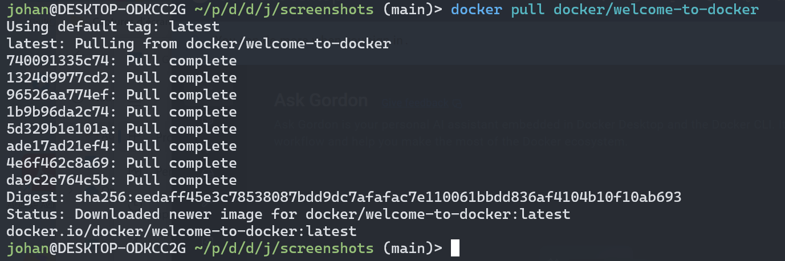

### Docker images

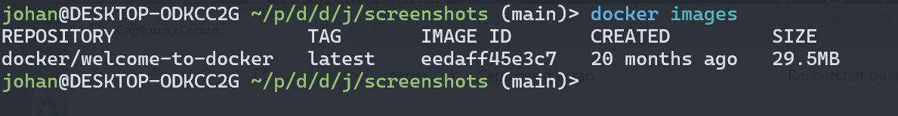

### Docker run

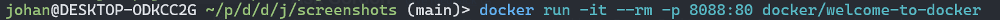

### Docker stop

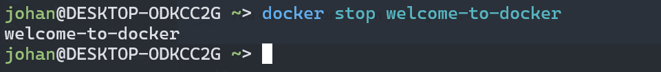

---

## Command lines to delete containers:

### One container

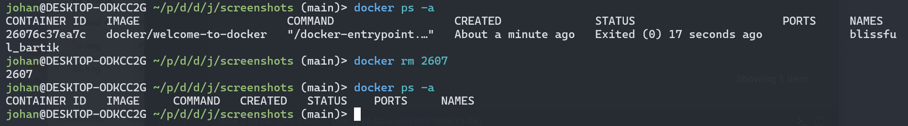

### Multiple containers

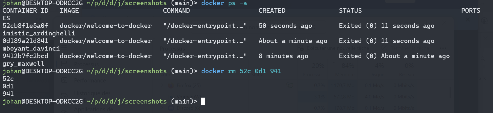

### Inactive containers

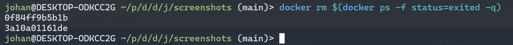

### Active container

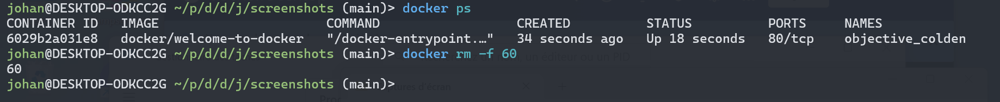

---

## Command lines to delete images:

### One image

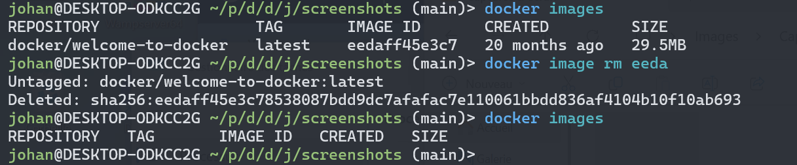

### Multiple images

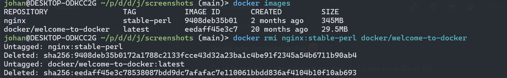

### Active image

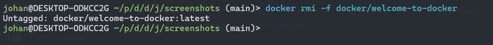
