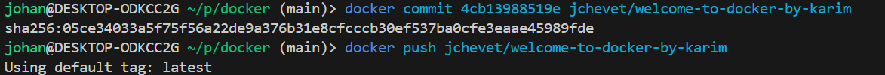

# Welcome to Docker - Part 1

---

### Créer l’image docker à partir de ce projet de sorte que le fichier dockerfile soit pris en compte

### Lancer l’image docker que vous venez de créer et lancer un container avec

### Vérifiez s’il est lancé et d’autres commandes de bases que vous avez faites dans le premier exercice

### Accéder au container pour visualiser le résultat

### Retournez dans Visual Studio et coder quelques lignes dans votre projet. Vérifiez le résultat faites en sorte que vos modifications soient prises en compte dans votre image docker et votre container

- Rebuild l'image pour voir les modifications
  

### Publier sur votre compte docker une image docker, et rendez la disponible à un membre de votre promo

### Récupérer une image docker d’un membre de votre promo et refaites les tests et modifications sur celle-ci (citez l’auteur de l’image d’origine dans la page)

### Publier sur votre Docker l’image modifié du membre de votre promo

