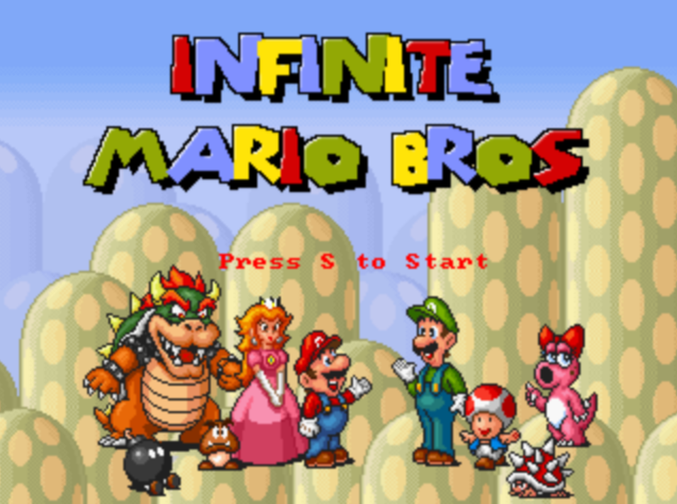

# Docker Jour01/Job03

---

### Trouver le terminal dans Docker Desktop. Chercher l’image docker cité ci-dessus par une commande dans ce dernier

### Récupérer l’image Docker dans "Docker-Desktop"

### Lancer un container avec cette image et assignez lui le port 8600 en considérant que l’image est configuré sur le port 8080 et en conservant l'accès à l’invite de commande

- Depuis terminal
  
- Depuis Docker Desktop
  

### Accéder et jouer un peu dans votre explorateur internet (faites des captures du jeux en cours “3 au moins”)

### Arrêter votre container par son ID (2 manière de trouver l’ID)

### Supprimer le container (2 manières)

### Supprimer l’image docker de super mario

